# igorgabs05.github.io]
<!DOCTYPE html>
<html lang="pt-BR">
<head>
    <meta charset="UTF-8">
    <meta name="viewport" content="width=device-width, initial-scale=1.0">
    <title>Hecate - Roupas Alternativas</title>
    <link href="https://stackpath.bootstrapcdn.com/bootstrap/4.5.2/css/bootstrap.min.css" rel="stylesheet">
    <link href="https://cdnjs.cloudflare.com/ajax/libs/font-awesome/5.15.4/css/all.min.css" rel="stylesheet">
    <link href="https://fonts.googleapis.com/css2?family=Arimo:wght@400;700&display=swap" rel="stylesheet">
    <link rel="stylesheet" type="text/css" href="style.css">
</head>
<body>

    <!-- Top Fixed Bar -->

        

            FRETE GRÁTIS APARTIR DE R$150
        

        

            ONDE ENCONTRAR
            RASTREAR PEDIDO
            CONTATO
            

                <a href="#"><i class="fab fa-whatsapp"></i></a>
                <a href="#"><i class="fab fa-facebook-f"></i></a>
                <a href="#"><i class="fab fa-instagram"></i></a>
            

        

    

</body>
</html>

    <!-- Main Navbar -->
   <nav class="navbar navbar-expand-lg navbar-white bg-white">
        <button class="navbar-toggler" type="button" data-toggle="collapse" data-target="#navbarNav" aria-controls="navbarNav" aria-expanded="false" aria-label="Toggle navigation">
            
        </button>
        
        

            <ul class="navbar-nav ml-auto">
                <li class="nav-item">
                    <a class="nav-link" href="#"><i class="fas fa-search"></i> pesquisar</a>
                </li>
                 <li class="nav-item">
         <a class="nav-link" href="#"><i class="fas fa-heart"></i></a>
                </li>
                <li class="nav-item">
                    <a class="nav-link" href="#collection"><i class="fas fa-shopping-cart"></i></a>
                </li>
                <li class="nav-item">
                    <a class="nav-link" href="file:///C:/Users/beatr/OneDrive/Área%20de%20Trabalho/hecate/login.htm"><i class="fas fa-user"></i> Entrar/Cadastre-se</a>
                </li>
            </ul>
        

    </nav>

    <!-- Secondary Navbar -->
  <nav class="navbar secondary-nav navbar-expand-lg navbar-light">
        

            <ul class="navbar-nav">
                <li class="nav-item"><a class="nav-link" href="#">Home</a></li>
                <li class="nav-item"><a class="nav-link" href="#">Todos</a></li>
                <li class="nav-item"><a class="nav-link" href="#">Femininos</a></li>
                <li class="nav-item"><a class="nav-link" href="#">Masculino</a></li>
                <li class="nav-item"><a class="nav-link" href="#">Plus Size</a></li>
                <li class="nav-item"><a class="nav-link" href="#">Calçados</a></li>
                <li class="nav-item"><a class="nav-link" href="#">Acessórios</a></li>
                <li class="nav-item"><a class="nav-link" href="#">Ofertas</a></li>
                <li class="nav-item"><a class="nav-link" href="#">Reposições</a></li>
            </ul>
        

    </nav>

    <!-- Carousel -->
 

        <ol class="carousel-indicators">
            <li data-target="#bannerCarousel" data-slide-to="0" class="active"></li>
            <li data-target="#bannerCarousel" data-slide-to="1"></li>
            <li data-target="#bannerCarousel" data-slide-to="2"></li>
        </ol>
        

            

                

                

             

            

                

                

           

            

                

                

            

        

        <a class="carousel-control-prev" href="#bannerCarousel" role="button" data-slide="prev">
            
            Anterior
        </a>
        <a class="carousel-control-next" href="#bannerCarousel" role="button" data-slide="next">
            
            Próximo
        </a>
    

    <!-- Seção de Caixas de Compras -->
 <section id="shop" class="py-5 bg-light">
        

            <h2 class="text-center">novidades</h2>
            

                

                    

                        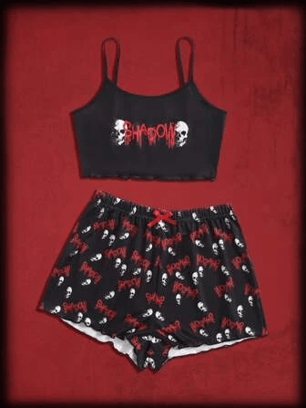
                        

                            <h5 class="card-title">pijama</h5>
                    
Nome do produto

                    
<strong>R$ 54,90</strong>

                    
em até 2x de R$ 27,45 sem juros

                    
Por R$ 53,41 no PIX

                     <button type="button" class="btn btn-secondary btn-custom" data-bs-toggle="tooltip" data-bs-placement="right" data-bs-title="Tooltip on right">pp</button>
                     <button type="button" class="btn btn-secondary btn-custom" data-bs-toggle="tooltip" data-bs-placement="right" data-bs-title="Tooltip on right">p</button>
                           <button type="button" class="btn btn-secondary btn-custom" data-bs-toggle="tooltip" data-bs-placement="right" data-bs-title="Tooltip on right">m</button>
                <button type="button" class="btn btn-secondary btn-custom" data-bs-toggle="tooltip" data-bs-placement="bottom" data-bs-title="Tooltip on bottom">g</button>
                <button type="button" class="btn btn-secondary btn-custom" data-bs-toggle="tooltip" data-bs-placement="left" data-bs-title="Tooltip on left">gg</button>
                </button>
                    <a href="#" class="btn btn-primary" style="margin-top:20px;">Ver opções</a>
                        

                    

                

                

                    

                        
                        

                           <h5 class="card-title">meia calça rasgada</h5>
                    
Nome do produto

                    
<strong>R$ 32,00</strong>

                    
em até 2x de R$ 16,00 sem juros

                    
Por R$ 31,40 no PIX

                     <button type="button" class="btn btn-secondary btn-custom" data-bs-toggle="tooltip" data-bs-placement="right" data-bs-title="Tooltip on right">pp</button>
                     <button type="button" class="btn btn-secondary btn-custom" data-bs-toggle="tooltip" data-bs-placement="right" data-bs-title="Tooltip on right">p</button>
                          <button type="button" class="btn btn-secondary btn-custom" data-bs-toggle="tooltip" data-bs-placement="right" data-bs-title="Tooltip on right">m</button>
                <button type="button" class="btn btn-secondary btn-custom" data-bs-toggle="tooltip" data-bs-placement="bottom" data-bs-title="Tooltip on bottom">g</button>
                <button type="button" class="btn btn-secondary btn-custom" data-bs-toggle="tooltip" data-bs-placement="left" data-bs-title="Tooltip on left">gg</button>
                </button>
                    <a href="#" class="btn btn-primary" style="margin-top:20px;">Ver opções</a>
                        

                    

                

                

                    

                        
                        

                            <h5 class="card-title">Produto 3</h5>
                    
Nome do produto

                    
<strong>R$ 169,90</strong>

                    
em até 6x de R$ 28,32 sem juros

                    
Por R$ 161,41 no PIX

                     <button type="button" class="btn btn-secondary btn-custom" data-bs-toggle="tooltip" data-bs-placement="right" data-bs-title="Tooltip on right">pp</button>
                     <button type="button" class="btn btn-secondary btn-custom" data-bs-toggle="tooltip" data-bs-placement="right" data-bs-title="Tooltip on right">p</button>
                            <button type="button" class="btn btn-secondary btn-custom" data-bs-toggle="tooltip" data-bs-placement="right" data-bs-title="Tooltip on right">m</button>
                <button type="button" class="btn btn-secondary btn-custom" data-bs-toggle="tooltip" data-bs-placement="bottom" data-bs-title="Tooltip on bottom">g</button>
                <button type="button" class="btn btn-secondary btn-custom" data-bs-toggle="tooltip" data-bs-placement="left" data-bs-title="Tooltip on left">gg</button>
                </button>
                    <a href="#" class="btn btn-primary" style="margin-top:20px;">Ver opções</a>
                        

                    

                

                

                    

                        
                        

                            <h5 class="card-title">Produto 3</h5>
                    
Nome do produto

                    
<strong>R$ 169,90</strong>

                    
em até 6x de R$ 28,32 sem juros

                    
Por R$ 161,41 no PIX

                     <button type="button" class="btn btn-secondary btn-custom" data-bs-toggle="tooltip" data-bs-placement="right" data-bs-title="Tooltip on right">pp</button>
                     <button type="button" class="btn btn-secondary btn-custom" data-bs-toggle="tooltip" data-bs-placement="right" data-bs-title="Tooltip on right">p</button>
                           <button type="button" class="btn btn-secondary btn-custom" data-bs-toggle="tooltip" data-bs-placement="right" data-bs-title="Tooltip on right">m</button>
                <button type="button" class="btn btn-secondary btn-custom" data-bs-toggle="tooltip" data-bs-placement="bottom" data-bs-title="Tooltip on bottom">g</button>
                <button type="button" class="btn btn-secondary btn-custom" data-bs-toggle="tooltip" data-bs-placement="left" data-bs-title="Tooltip on left">gg</button>
                </button>
                    <a href="#" class="btn btn-primary" style="margin-top:20px;">Ver opções</a>
                        

                    

                

                

                    

                        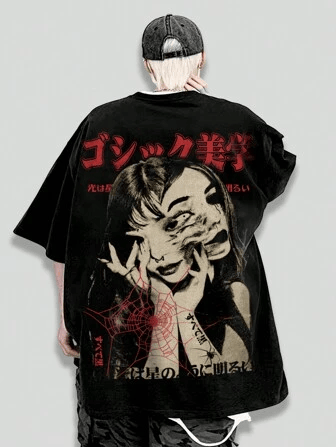
                        

                            <h5 class="card-title">Produto 3</h5>
                    
Nome do produto

                    
<strong>R$ 169,90</strong>

                    
em até 6x de R$ 28,32 sem juros

                    
Por R$ 161,41 no PIX

                     <button type="button" class="btn btn-secondary btn-custom" data-bs-toggle="tooltip" data-bs-placement="right" data-bs-title="Tooltip on right">pp</button>
                     <button type="button" class="btn btn-secondary btn-custom" data-bs-toggle="tooltip" data-bs-placement="right" data-bs-title="Tooltip on right">p</button>
                          <button type="button" class="btn btn-secondary btn-custom" data-bs-toggle="tooltip" data-bs-placement="right" data-bs-title="Tooltip on right">m</button>
                <button type="button" class="btn btn-secondary btn-custom" data-bs-toggle="tooltip" data-bs-placement="bottom" data-bs-title="Tooltip on bottom">g</button>
                <button type="button" class="btn btn-secondary btn-custom" data-bs-toggle="tooltip" data-bs-placement="left" data-bs-title="Tooltip on left">gg</button>
                </button>
                    <a href="#" class="btn btn-primary" style="margin-top:20px;">Ver opções</a>
                        

                    

                

                

                    

                        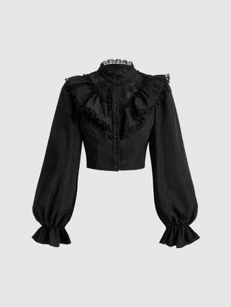
                        

                            <h5 class="card-title">Produto 3</h5>
                    
Nome do produto

                    
<strong>R$ 169,90</strong>

                    
em até 6x de R$ 28,32 sem juros

                    
Por R$ 161,41 no PIX

                     <button type="button" class="btn btn-secondary btn-custom" data-bs-toggle="tooltip" data-bs-placement="right" data-bs-title="Tooltip on right">pp</button>
                     <button type="button" class="btn btn-secondary btn-custom" data-bs-toggle="tooltip" data-bs-placement="right" data-bs-title="Tooltip on right">p</button>
                           <button type="button" class="btn btn-secondary btn-custom" data-bs-toggle="tooltip" data-bs-placement="right" data-bs-title="Tooltip on right">m</button>
                <button type="button" class="btn btn-secondary btn-custom" data-bs-toggle="tooltip" data-bs-placement="bottom" data-bs-title="Tooltip on bottom">g</button>
                <button type="button" class="btn btn-secondary btn-custom" data-bs-toggle="tooltip" data-bs-placement="left" data-bs-title="Tooltip on left">gg</button>
                </button>
                    <a href="#" class="btn btn-primary" style="margin-top:20px;">Ver opções</a>
                    

                

            

            <!-- Segunda Linha de Caixas de Compras -->
            

            <h2 class="text-center">voltarams</h2>
            

                

                    

                        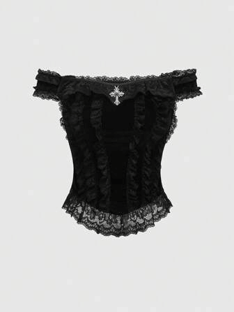
                        

                            <h5 class="card-title">Produto 3</h5>
                    
Nome do produto

                    
<strong>R$ 169,90</strong>

                    
em até 6x de R$ 28,32 sem juros

                    
Por R$ 161,41 no PIX

                     <button type="button" class="btn btn-secondary btn-custom" data-bs-toggle="tooltip" data-bs-placement="right" data-bs-title="Tooltip on right">pp</button>
                     <button type="button" class="btn btn-secondary btn-custom" data-bs-toggle="tooltip" data-bs-placement="right" data-bs-title="Tooltip on right">p</button>
                         <button type="button" class="btn btn-secondary btn-custom" data-bs-toggle="tooltip" data-bs-placement="right" data-bs-title="Tooltip on right">m</button>
                <button type="button" class="btn btn-secondary btn-custom" data-bs-toggle="tooltip" data-bs-placement="bottom" data-bs-title="Tooltip on bottom">g</button>
                <button type="button" class="btn btn-secondary btn-custom" data-bs-toggle="tooltip" data-bs-placement="left" data-bs-title="Tooltip on left">gg</button>
                </button>
                    <a href="#" class="btn btn-primary" style="margin-top:20px;">Ver opções</a>
                        

                    

                

                

                    

                        
                        

                           <h5 class="card-title">Produto 3</h5>
                    
Nome do produto

                    
<strong>R$ 169,90</strong>

                    
em até 6x de R$ 28,32 sem juros

                    
Por R$ 161,41 no PIX

                     <button type="button" class="btn btn-secondary btn-custom" data-bs-toggle="tooltip" data-bs-placement="right" data-bs-title="Tooltip on right">pp</button>
                     <button type="button" class="btn btn-secondary btn-custom" data-bs-toggle="tooltip" data-bs-placement="right" data-bs-title="Tooltip on right">p</button>
                           <button type="button" class="btn btn-secondary btn-custom" data-bs-toggle="tooltip" data-bs-placement="right" data-bs-title="Tooltip on right">m</button>
                <button type="button" class="btn btn-secondary btn-custom" data-bs-toggle="tooltip" data-bs-placement="bottom" data-bs-title="Tooltip on bottom">g</button>
                <button type="button" class="btn btn-secondary btn-custom" data-bs-toggle="tooltip" data-bs-placement="left" data-bs-title="Tooltip on left">gg</button>
                </button>
                    <a href="#" class="btn btn-primary" style="margin-top:20px;">Ver opções</a>
                        

                    

                

                

                    

                        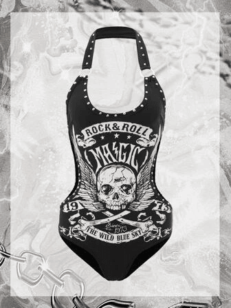
                        

                            <h5 class="card-title">Produto 3</h5>
                    
Nome do produto

                    
<strong>R$ 169,90</strong>

                    
em até 6x de R$ 28,32 sem juros

                    
Por R$ 161,41 no PIX

                     <button type="button" class="btn btn-secondary btn-custom" data-bs-toggle="tooltip" data-bs-placement="right" data-bs-title="Tooltip on right">pp</button>
                     <button type="button" class="btn btn-secondary btn-custom" data-bs-toggle="tooltip" data-bs-placement="right" data-bs-title="Tooltip on right">p</button>
                          <button type="button" class="btn btn-secondary btn-custom" data-bs-toggle="tooltip" data-bs-placement="right" data-bs-title="Tooltip on right">m</button>
                <button type="button" class="btn btn-secondary btn-custom" data-bs-toggle="tooltip" data-bs-placement="bottom" data-bs-title="Tooltip on bottom">g</button>
                <button type="button" class="btn btn-secondary btn-custom" data-bs-toggle="tooltip" data-bs-placement="left" data-bs-title="Tooltip on left">gg</button>
                </button>
                    <a href="#" class="btn btn-primary" style="margin-top:20px;">Ver opções</a>
                        

                    

                

                

                    

                        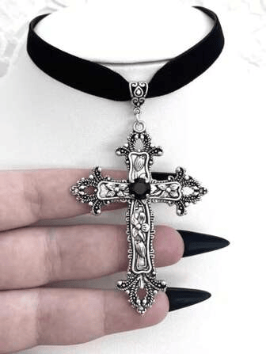
                        

                            <h5 class="card-title">Produto 3</h5>
                    
Nome do produto

                    
<strong>R$ 169,90</strong>

                    
em até 6x de R$ 28,32 sem juros

                    
Por R$ 161,41 no PIX

                     <button type="button" class="btn btn-secondary btn-custom" data-bs-toggle="tooltip" data-bs-placement="right" data-bs-title="Tooltip on right">pp</button>
                     <button type="button" class="btn btn-secondary btn-custom" data-bs-toggle="tooltip" data-bs-placement="right" data-bs-title="Tooltip on right">p</button>
                           <button type="button" class="btn btn-secondary btn-custom" data-bs-toggle="tooltip" data-bs-placement="right" data-bs-title="Tooltip on right">m</button>
                <button type="button" class="btn btn-secondary btn-custom" data-bs-toggle="tooltip" data-bs-placement="bottom" data-bs-title="Tooltip on bottom">g</button>
                <button type="button" class="btn btn-secondary btn-custom" data-bs-toggle="tooltip" data-bs-placement="left" data-bs-title="Tooltip on left">gg</button>
                </button>
                    <a href="#" class="btn btn-primary" style="margin-top:20px;">Ver opções</a>
                        

                    

                

                

                    

                        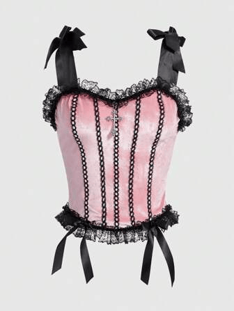
                        

                            <h5 class="card-title">Produto 3</h5>
                    
Nome do produto

                    
<strong>R$ 169,90</strong>

                    
em até 6x de R$ 28,32 sem juros

                    
Por R$ 161,41 no PIX

                     <button type="button" class="btn btn-secondary btn-custom" data-bs-toggle="tooltip" data-bs-placement="right" data-bs-title="Tooltip on right">pp</button>
                     <button type="button" class="btn btn-secondary btn-custom" data-bs-toggle="tooltip" data-bs-placement="right" data-bs-title="Tooltip on right">p</button>
                           <button type="button" class="btn btn-secondary btn-custom" data-bs-toggle="tooltip" data-bs-placement="right" data-bs-title="Tooltip on right">m</button>
                <button type="button" class="btn btn-secondary btn-custom" data-bs-toggle="tooltip" data-bs-placement="bottom" data-bs-title="Tooltip on bottom">g</button>
                <button type="button" class="btn btn-secondary btn-custom" data-bs-toggle="tooltip" data-bs-placement="left" data-bs-title="Tooltip on left">gg</button>
                    <a href="#" class="btn btn-primary" style="margin-top:20px;">Ver opções</a>
                        

                    

  

                

                    

                        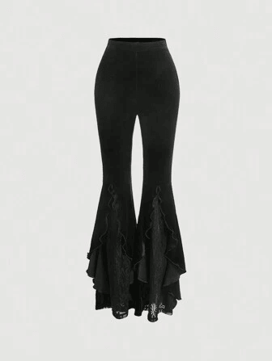
                        

                         <h5 class="card-title">Produto 3</h5>
                    
Nome do produto

              
<strong>R$ 169,90</strong>

                    
em até 6x de R$ 28,32 sem juros

                    
Por R$ 161,41 no PIX

                     <button type="button" class="btn btn-secondary btn-custom" data-bs-toggle="tooltip" data-bs-placement="right" data-bs-title="Tooltip on right">pp</button>
                     <button type="button" class="btn btn-secondary btn-custom" data-bs-toggle="tooltip" data-bs-placement="right" data-bs-title="Tooltip on right">p</button>
                          <button type="button" class="btn btn-secondary btn-custom" data-bs-toggle="tooltip" data-bs-placement="right" data-bs-title="Tooltip on right">m</button>
                <button type="button" class="btn btn-secondary btn-custom" data-bs-toggle="tooltip" data-bs-placement="bottom" data-bs-title="Tooltip on bottom">g</button>
                <button type="button" class="btn btn-secondary btn-custom" data-bs-toggle="tooltip" data-bs-placement="left" data-bs-title="Tooltip on left">gg</button>
                </button>
                    <a href="#" class="btn btn-primary" style="margin-top:20px;">Ver opções</a>
                        

                

            

    <!--  Banner Abaixo da segunda Fileira -->

    

    

    

    

    

  

            <h2 class="text-center">mais vendidos</h2>
            

                

                    

                        
                        

                            <h5 class="card-title">Produto 3</h5>
                    
Nome do produto

                    
<strong>R$ 169,90</strong>

                    
em até 6x de R$ 28,32 sem juros

                    
Por R$ 161,41 no PIX

                     <button type="button" class="btn btn-secondary btn-custom" data-bs-toggle="tooltip" data-bs-placement="right" data-bs-title="Tooltip on right">pp</button>
                     <button type="button" class="btn btn-secondary btn-custom" data-bs-toggle="tooltip" data-bs-placement="right" data-bs-title="Tooltip on right">p</button>
                            <button type="button" class="btn btn-secondary btn-custom" data-bs-toggle="tooltip" data-bs-placement="right" data-bs-title="Tooltip on right">m</button>
                <button type="button" class="btn btn-secondary btn-custom" data-bs-toggle="tooltip" data-bs-placement="bottom" data-bs-title="Tooltip on bottom">g</button>
                <button type="button" class="btn btn-secondary btn-custom" data-bs-toggle="tooltip" data-bs-placement="left" data-bs-title="Tooltip on left">gg</button>
                </button>
                    <a href="#" class="btn btn-primary" style="margin-top:20px;">Ver opções</a>
                        

                    

                

                

                    

                        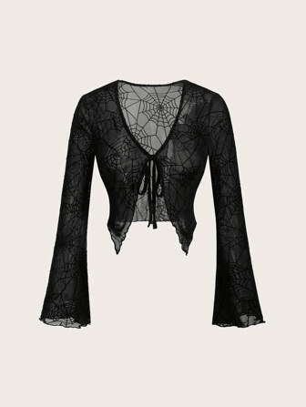
                        

                           <h5 class="card-title">Produto 3</h5>
                    
Nome do produto

                    
<strong>R$ 169,90</strong>

                    
em até 6x de R$ 28,32 sem juros

                    
Por R$ 161,41 no PIX

                     <button type="button" class="btn btn-secondary btn-custom" data-bs-toggle="tooltip" data-bs-placement="right" data-bs-title="Tooltip on right">pp</button>
                     <button type="button" class="btn btn-secondary btn-custom" data-bs-toggle="tooltip" data-bs-placement="right" data-bs-title="Tooltip on right">p</button>
                         <button type="button" class="btn btn-secondary btn-custom" data-bs-toggle="tooltip" data-bs-placement="right" data-bs-title="Tooltip on right">m</button>
                <button type="button" class="btn btn-secondary btn-custom" data-bs-toggle="tooltip" data-bs-placement="bottom" data-bs-title="Tooltip on bottom">g</button>
                <button type="button" class="btn btn-secondary btn-custom" data-bs-toggle="tooltip" data-bs-placement="left" data-bs-title="Tooltip on left">gg</button>
                </button>
                    <a href="#" class="btn btn-primary" style="margin-top:20px;">Ver opções</a>
                        

                    

                

                

                    

                        
                        

                            <h5 class="card-title">Produto 3</h5>
                    
Nome do produto

                    
<strong>R$ 169,90</strong>

                    
em até 6x de R$ 28,32 sem juros

                    
Por R$ 161,41 no PIX

                     <button type="button" class="btn btn-secondary btn-custom" data-bs-toggle="tooltip" data-bs-placement="right" data-bs-title="Tooltip on right">pp</button>
                     <button type="button" class="btn btn-secondary btn-custom" data-bs-toggle="tooltip" data-bs-placement="right" data-bs-title="Tooltip on right">p</button>
                           <button type="button" class="btn btn-secondary btn-custom" data-bs-toggle="tooltip" data-bs-placement="right" data-bs-title="Tooltip on right">m</button>
                <button type="button" class="btn btn-secondary btn-custom" data-bs-toggle="tooltip" data-bs-placement="bottom" data-bs-title="Tooltip on bottom">g</button>
                <button type="button" class="btn btn-secondary btn-custom" data-bs-toggle="tooltip" data-bs-placement="left" data-bs-title="Tooltip on left">gg</button>
                </button>
                    <a href="#" class="btn btn-primary" style="margin-top:20px;">Ver opções</a>
                        

                    

                

                

                    

                        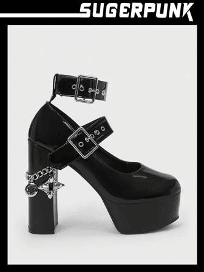
                        

                            <h5 class="card-title">Produto 3</h5>
                    
Nome do produto

                    
<strong>R$ 169,90</strong>

                    
em até 6x de R$ 28,32 sem juros

                    
Por R$ 161,41 no PIX

                     <button type="button" class="btn btn-secondary btn-custom" data-bs-toggle="tooltip" data-bs-placement="right" data-bs-title="Tooltip on right">pp</button>
                     <button type="button" class="btn btn-secondary btn-custom" data-bs-toggle="tooltip" data-bs-placement="right" data-bs-title="Tooltip on right">p</button>
                           <button type="button" class="btn btn-secondary btn-custom" data-bs-toggle="tooltip" data-bs-placement="right" data-bs-title="Tooltip on right">m</button>
                <button type="button" class="btn btn-secondary btn-custom" data-bs-toggle="tooltip" data-bs-placement="bottom" data-bs-title="Tooltip on bottom">g</button>
                <button type="button" class="btn btn-secondary btn-custom" data-bs-toggle="tooltip" data-bs-placement="left" data-bs-title="Tooltip on left">gg</button>
                    <a href="#" class="btn btn-primary" style="margin-top:20px;">Ver opções</a>
                        

                    

                

                

                    

                        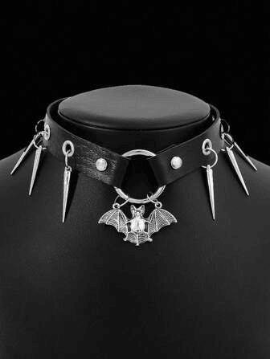
                        

                            <h5 class="card-title">Produto 3</h5>
                    
Nome do produto

                    
<strong>R$ 169,90</strong>

                    
em até 6x de R$ 28,32 sem juros

                    
Por R$ 161,41 no PIX

                     <button type="button" class="btn btn-secondary btn-custom" data-bs-toggle="tooltip" data-bs-placement="right" data-bs-title="Tooltip on right">pp</button>
                     <button type="button" class="btn btn-secondary btn-custom" data-bs-toggle="tooltip" data-bs-placement="right" data-bs-title="Tooltip on right">p</button>
                            <button type="button" class="btn btn-secondary btn-custom" data-bs-toggle="tooltip" data-bs-placement="right" data-bs-title="Tooltip on right">m</button>
                <button type="button" class="btn btn-secondary btn-custom" data-bs-toggle="tooltip" data-bs-placement="bottom" data-bs-title="Tooltip on bottom">g</button>
                <button type="button" class="btn btn-secondary btn-custom" data-bs-toggle="tooltip" data-bs-placement="left" data-bs-title="Tooltip on left">gg</button>
                </button>
                    <a href="#" class="btn btn-primary" style="margin-top:20px;">Ver opções</a>
                        

                    

                

                

                    

                        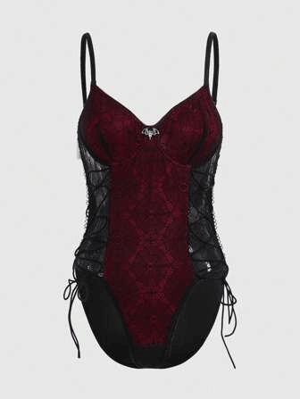
                        

                            <h5 class="card-title">Produto 3</h5>
                    
Nome do produto

                    
<strong>R$ 169,90</strong>

                    
em até 6x de R$ 28,32 sem juros

                    
Por R$ 161,41 no PIX

                     <button type="button" class="btn btn-secondary btn-custom" data-bs-toggle="tooltip" data-bs-placement="right" data-bs-title="Tooltip on right">pp</button>
                     <button type="button" class="btn btn-secondary btn-custom" data-bs-toggle="tooltip" data-bs-placement="right" data-bs-title="Tooltip on right">p</button>
                           <button type="button" class="btn btn-secondary btn-custom" data-bs-toggle="tooltip" data-bs-placement="right" data-bs-title="Tooltip on right">m</button>
                <button type="button" class="btn btn-secondary btn-custom" data-bs-toggle="tooltip" data-bs-placement="bottom" data-bs-title="Tooltip on bottom">g</button>
                <button type="button" class="btn btn-secondary btn-custom" data-bs-toggle="tooltip" data-bs-placement="left" data-bs-title="Tooltip on left">gg</button>
                </button>
                    <a href="#" class="btn btn-primary" style="margin-top:20px;">Ver opções</a>
                    

                

            

 <!-- Banner e Última Linha de Produtos -->

    

        

            

        

        

            

                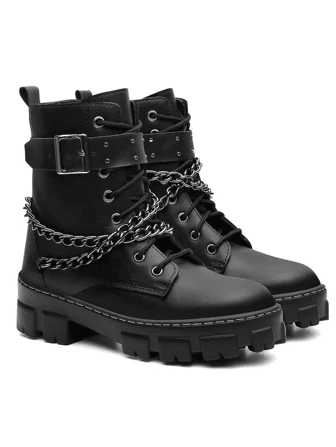
                

                    <h5 class="card-title">Produto 3</h5>
                    
Nome do produto

                    
<strong>R$ 169,90</strong>

                    
em até 6x de R$ 28,32 sem juros

                    
Por R$ 161,41 no PIX

                     <button type="button" class="btn btn-secondary btn-custom" data-bs-toggle="tooltip" data-bs-placement="right" data-bs-title="Tooltip on right">pp</button>
                     <button type="button" class="btn btn-secondary btn-custom" data-bs-toggle="tooltip" data-bs-placement="right" data-bs-title="Tooltip on right">p</button>
                    <button type="button" class="btn btn-secondary btn-custom" data-bs-toggle="tooltip" data-bs-placement="right" data-bs-title="Tooltip on right">m</button>
                <button type="button" class="btn btn-secondary btn-custom" data-bs-toggle="tooltip" data-bs-placement="bottom" data-bs-title="Tooltip on bottom">g</button>
                <button type="button" class="btn btn-secondary btn-custom" data-bs-toggle="tooltip" data-bs-placement="left" data-bs-title="Tooltip on left">gg</button>
                </button>
                    <a href="#" class="btn btn-primary" style="margin-top:20px;">Ver opções</a>
                

            

        

        

            

                
                

                    <h5 class="card-title">Produto 3</h5>
                    
Nome do produto

                    
<strong>R$ 169,90</strong>

                    
em até 6x de R$ 28,32 sem juros

                    
Por R$ 161,41 no PIX

                     <button type="button" class="btn btn-secondary btn-custom" data-bs-toggle="tooltip" data-bs-placement="right" data-bs-title="Tooltip on right">pp</button>
                     <button type="button" class="btn btn-secondary btn-custom" data-bs-toggle="tooltip" data-bs-placement="right" data-bs-title="Tooltip on right">p</button>
                    <button type="button" class="btn btn-secondary btn-custom" data-bs-toggle="tooltip" data-bs-placement="right" data-bs-title="Tooltip on right">m</button>
                <button type="button" class="btn btn-secondary btn-custom" data-bs-toggle="tooltip" data-bs-placement="bottom" data-bs-title="Tooltip on bottom">g</button>
                <button type="button" class="btn btn-secondary btn-custom" data-bs-toggle="tooltip" data-bs-placement="left" data-bs-title="Tooltip on left">gg</button>
                </button>
                    <a href="#" class="btn btn-primary" style="margin-top:20px;">Ver opções</a>
                

            

        

        

            

                
                

                   <h5 class="card-title">Produto 3</h5>
                    
Nome do produto

                    
<strong>R$ 169,90</strong>

                    
em até 6x de R$ 28,32 sem juros

                    
Por R$ 161,41 no PIX

                     <button type="button" class="btn btn-secondary btn-custom" data-bs-toggle="tooltip" data-bs-placement="right" data-bs-title="Tooltip on right">pp</button>
                     <button type="button" class="btn btn-secondary btn-custom" data-bs-toggle="tooltip" data-bs-placement="right" data-bs-title="Tooltip on right">p</button>
               <button type="button" class="btn btn-secondary btn-custom" data-bs-toggle="tooltip" data-bs-placement="right" data-bs-title="Tooltip on right">m</button>
                <button type="button" class="btn btn-secondary btn-custom" data-bs-toggle="tooltip" data-bs-placement="bottom" data-bs-title="Tooltip on bottom">g</button>
                <button type="button" class="btn btn-secondary btn-custom" data-bs-toggle="tooltip" data-bs-placement="left" data-bs-title="Tooltip on left">gg</button>
                </button>
                    <a href="#" class="btn btn-primary" style="margin-top:20px;">Ver opções</a>
                

            

        

    

    
    
    
</body>
</html>
